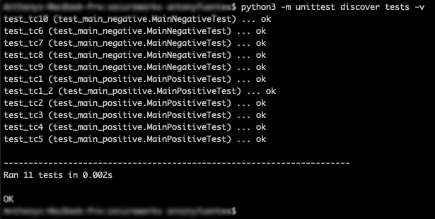

# unittest-coding-challenge

## Develop code that will meet the requirements listed below:
- Read input from a file of words;
- Find the largest word in the file
- Transpose the letters in the largest word
- Show the largest word and the largest word transposed
- Demonstrate positive and negative test cases
- Ensure you document code and instructions for building and running

## Notes:
- This project was only tested against Python 3.6, this code is not compatible with Python 2.7
- Code was written and tested on a mac computer
- 11 testscases were written in total, where 6 are positive TCs and 5 are negative TCs

## Instructions:
- cd into the root folder of this project
- In order to execute the unittests, run the following command:
  - python3 -m unittest discover tests -v
  - Command output should look like this:
    - 
- Main program can also be executed directy, example:
  - python3 main.py
